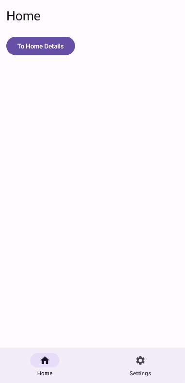

# Navigating Back Through a Hierarchy

After successfully setting up Compose Navigation to swap tabs in [Part One,](https://michiganlabs.com/news/cross-tab-navigation-in-jetpack-compose) dealing with the back stack might quickly become the next concern. Previously, we would navigate from "Settings" into "Home - Details" and verify that the back button navigated up the "Home" tabs tree. However, what if we were to navigate further into the tree?

Note that the following functionality may or may not make sense in your app, but there may come a time where you want to provide the full navigation stack so that a User can more naturally traverse up the screen. 

To decide if this is you, imagine we have a TV Show streaming app, and we have a Home screen, Show Screen, Episode Screen, and then the Video Player. If I were to be on the Home screen and tap a recently played icon that navigates directly into the Video Player, and then I swipe back, where would I end up?

If your answer is back on the home screen, then fantastic! Everything works exactly as intended!

If your answer is, well it would be nice to show the Episode Screen and then the Show Screen and _then_ the Home Screen, you may want to make keep reading.

But, before we get started, lets take a look at how this will look without any additional work. Note that navigating through the buttons Home -> To Details -> To Extra Details the back button walks up the tree. However, when navigating from Settings -> To Details Extra the back button _skips_ Home - Details (because it was never in the stack). At this point, it is probably important to note that this is a partial consequence of [Part One](https://michiganlabs.com/news/cross-tab-navigation-in-jetpack-compose) in which we separated the navigation stacks by the tab you are on, and back button doesn't return you back to Settings.



So how do we modify that? Browsing the documentation I started wondering if [`BackHandler`](https://developer.android.com/jetpack/compose/libraries#handling_the_system_back_button) was the path forward. Further searching led me to a [Stack Overflow](https://stackoverflow.com/a/71513385/2461717) answer that I was able to adopt into a solution that seems to work pretty well.

Starting with an extension to `NavHostController` similar to [Part One](https://michiganlabs.com/news/cross-tab-navigation-in-jetpack-compose) we provide a new `popUpTo` function that checks to see if the destination is in the tree, pops up to it if it is, or navigates to it and pops the current screen off the stack. 

```kotlin
/**
 * Attempt to pop up to the destination. If the destination is present
 * in the back stack then it will pop up to it. If the destination
 * is not present in the back stack it will navigate to it and remove
 * the current screen from the stack.
 */
fun NavHostController.popUpTo(route: String) {
  try {
    this.getBackStackEntry(route)
    popBackStack(route, false)
  } catch (exception: IllegalArgumentException) {
    navigate(route) {
      currentBackStackEntry?.destination?.route?.let {
        popUpTo(it) {
          inclusive = true
        }
      }
    }
  }
}
```

Why is this interesting? A few reasons.

1. If you attempt to `popBackStack(route, false)` and `route` is not in the back stack, you won't navigate at all and your back button is now broken.
1. If you attempt to `popBackStack(route, true)` you will pop the screen that you wanted to navigate to off the stack and end up navigating _too_ far.
1. If you attempt to `popBackStack(current_location, true)` you haven't _really_ done anything new. The current screen will be popped, but the stack has not been updated.

With a new "safer" way to handle navigating backwards, all that is left is to call it. Anytime I explicitly want to define the traversal up the heierarchy I implement the `BackHandler`.

```kotlin
fun NavGraphBuilder.homeGraph(navController: NavHostController) {
    navigation(
        startDestination = Route.HOME_OVERVIEW,
        route = Route.HOME_ROOT
    ) {
        composable(Route.HOME_OVERVIEW) {
            HomeOverview(
                toDetails = { navController.navigate(Route.HOME_DETAILS) },
                modifier = Modifier
                    .fillMaxSize()
                    .padding(16.dp)
            )
        }

        composable(Route.HOME_DETAILS) {
            BackHandler {
                navController.popUpTo(Route.HOME_OVERVIEW)
            }
            HomeDetails(
                toExtraDetails = { navController.navigate(Route.HOME_DETAILS_EXTRA) },
                modifier = Modifier
                    .fillMaxSize()
                    .padding(16.dp)
            )
        }

        composable(Route.HOME_DETAILS_EXTRA) {
            BackHandler {
                navController.popUpTo(Route.HOME_DETAILS)
            }
            HomeDetailsExtra(
                modifier = Modifier
                    .fillMaxSize()
                    .padding(16.dp)
            )
        }
    }
}
```

Now, when we navigate back, either naturally through the Home screen buttons or from the Settings screen, we get the same standardized navigation.


[View the sample project on GitHub.](https://github.com/scottschmitz/sample_compose_nav)